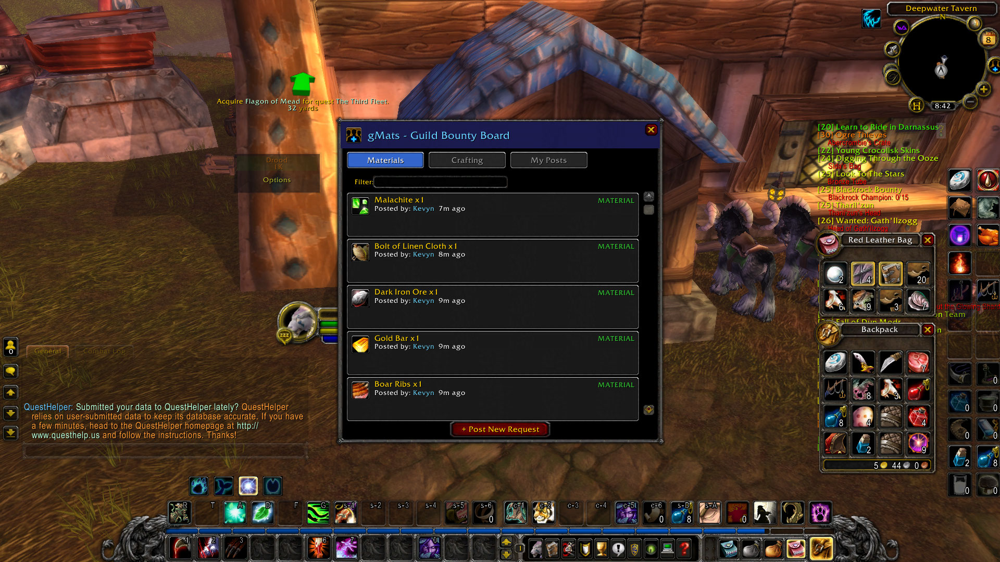
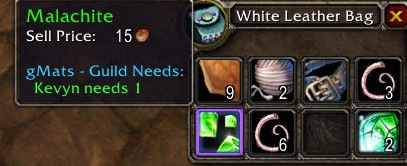

# gMats - Guild Bounty Board

> A WoW 3.3.5a addon for sharing material needs and crafting requests with your guild.

**WoW Version**: 3.3.5a (WotLK) · **Interface**: 30300 · **Compatible with**: Chromiecraft / AzerothCore

---

## Overview

gMats is a guild bounty board where players post material and crafting requests for guildmates to fill. When a guildmate encounters a wanted item — in a tooltip, loot drop, or their bags — gMats notifies them automatically. No more spamming guild chat asking who needs what.

## Features

### Bounty Board

The main window displays all active guild requests across three tabs: **Materials**, **Crafting**, and **My Posts**. Filter requests in real-time by item name or requester. Open it with `/gmat` or click the minimap button.



### Posting Material Requests

Create requests for raw materials your character needs. Search the built-in item database (~500+ trade goods), set quantities, and broadcast to the guild instantly.

### Posting Crafting Requests

Request crafting services by specifying the recipe, materials you'll provide, and materials you still need. Guildmates see exactly what's required to help.


### Item Search

A searchable dialog of common trade goods. Type to filter and click to select.

### Tooltip Integration

Hover over any item to see if a guildmate needs it. gMats hooks into the game tooltip to display requester name, quantity needed, and request type — color-coded in purple.



### Loot Alerts

When you loot or receive an item that a guildmate wants, gMats prints a chat alert with the item name, who needs it, and how many they need. Detection uses both loot messages and a bag-diff fallback scan.

### Mail Integration

Open your mailbox while a request is selected and gMats helps you fill it. A dialog shows what you have vs. what's needed, lets you pick quantities, then auto-composes a mail with the recipient, subject line, and item attachments — including stack splitting.

### Minimap Button

A draggable minimap button for quick access. Left-click toggles the board. The tooltip shows your active request count.

### Guild Sync

Board state syncs automatically across all online guild members. On login, gMats requests the full board from online players and merges it.

## Installation

1. Download a release or clone this repository
2. Copy the inner `gMats/` folder (the one containing `gMats.toc`) into your WoW client's addon directory:
   ```
   <WoW Install>/Interface/AddOns/gMats/
   ```
3. Launch WoW (or `/reload` if already in-game)
4. Verify the addon is enabled in the character select Addons menu

The folder structure should look like:
```
Interface/
  AddOns/
    gMats/
      gMats.toc
      Core.lua
      DataModel.lua
      ...
```

## Usage / Commands

All commands use `/gmat` (or `/gmats`).

| Command | Description |
|---------|-------------|
| `/gmat` | Toggle the bounty board window |
| `/gmat open` | Toggle the bounty board window |
| `/gmat status` | Show addon status (active request count, toggle states) |
| `/gmat tooltips` | Toggle tooltip notifications on/off |
| `/gmat alerts` | Toggle loot alert notifications on/off |
| `/gmat highlights` | Toggle bag item highlights on/off |
| `/gmat sync` | Force a board sync from online guild members |
| `/gmat help` | List all available commands |

## Settings

All settings persist across sessions in `gMatsDB.settings`.

| Setting | Default | Toggled via | Description |
|---------|---------|-------------|-------------|
| Tooltip notifications | On | `/gmat tooltips` | Show guild needs in item tooltips |
| Loot alerts | On | `/gmat alerts` | Chat notification when looting wanted items |
| Bag highlights | On | `/gmat highlights` | Purple border on wanted items in bags |
| Minimap position | 220° | Drag the button | Position of the minimap icon |
